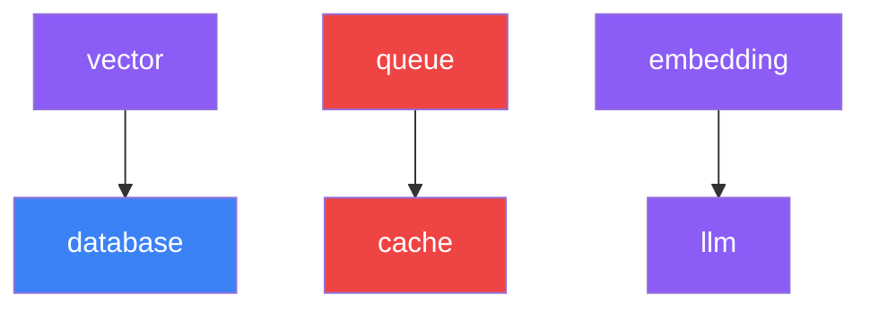

# lc component

Manage project components such as AI models, databases, storage, and other services. Components are the building blocks of your LocalCloud project.

## Usage

```bash
lc component <command> [arguments] [flags]
```

**Aliases**: `lc comp`

## Commands

### `lc component list`

List all available components and their status.

```bash
lc component list

# Aliases
lc component ls
lc comp list
```

**Output shows**:
- Component ID and name
- Installation status ( Installed, Ë Available)
- Description
- Dependencies

### `lc component add`

Add a component to your project.

```bash
lc component add <component-id>

# Examples
lc component add llm
lc component add embedding
lc component add vector
lc component add mongodb
lc component add cache
lc component add storage
```

**Interactive Features**:
- Model selection for AI components
- Dependency validation and auto-installation
- Configuration prompts
- Progress indicators

### `lc component remove`

Remove a component from your project.

```bash
lc component remove <component-id>

# Aliases
lc component rm
lc comp remove llm
```

**Safety Features**:
- Dependency check (warns if other components depend on this one)
- Confirmation prompt
- Data preservation options

### `lc component info`

Show detailed information about a component.

```bash
lc component info <component-id>

# Example
lc component info llm
```

**Information Displayed**:
- Component description
- Current status
- Dependencies
- Configuration
- Resource usage

### `lc component update`

Update component configuration (e.g., change model).

```bash
lc component update <component-id>

# Example
lc component update llm
```

## Available Components

### AI Components

#### `llm` - Language Model
- **Purpose**: Run large language models locally
- **Dependencies**: None
- **Models**: Llama, Mistral, Qwen, Gemma, etc.
- **Port**: 11434 (Ollama)

#### `embedding` - Embedding Model
- **Purpose**: Generate text embeddings for RAG
- **Dependencies**: `llm` (shares Ollama instance)
- **Models**: all-minilm, nomic-embed-text, etc.

#### `stt` - Speech-to-Text
- **Purpose**: Audio transcription
- **Dependencies**: None
- **Model**: OpenAI Whisper

### Database Components

#### `database` - PostgreSQL
- **Purpose**: Relational database
- **Dependencies**: None
- **Features**: Full PostgreSQL 16 with extensions
- **Port**: 5432

#### `mongodb` - MongoDB
- **Purpose**: NoSQL document database
- **Dependencies**: None
- **Features**: MongoDB 7.0 with auth
- **Port**: 27017

#### `vector` - Vector Database
- **Purpose**: Vector similarity search
- **Dependencies**: `database` (uses pgvector extension)
- **Features**: Hybrid search, RAG support

### Infrastructure Components

#### `cache` - Redis Cache
- **Purpose**: High-performance caching
- **Dependencies**: None
- **Features**: Redis 7 with persistence
- **Port**: 6379

#### `queue` - Message Queue
- **Purpose**: Background job processing
- **Dependencies**: `cache` (uses Redis)
- **Features**: Job scheduling, pub/sub

#### `storage` - Object Storage
- **Purpose**: S3-compatible file storage
- **Dependencies**: None
- **Features**: MinIO with web console
- **Port**: 9000/9001

## Examples

### Basic Component Management

```bash
# See what's available
lc component list

# Add database to project
lc component add database

# Add AI model
lc component add llm
# (Interactive model selection follows)

# Check what's installed
lc component list

# Get detailed info
lc component info llm
```

### Building an AI Chat App

```bash
# Add core components
lc component add llm
lc component add database
lc component add cache

# Add vector search for RAG
lc component add vector

# Check dependencies are satisfied
lc component list
```

### E-commerce Backend

```bash
# Add databases
lc component add database
lc component add mongodb

# Add infrastructure
lc component add cache
lc component add queue
lc component add storage

# Add AI for recommendations
lc component add llm
lc component add embedding
```

### Updating Components

```bash
# Change LLM model
lc component update llm
# Select new model from list

# Update database configuration
lc component update database
# Modify settings like memory allocation
```

## Component Dependencies

Dependencies are automatically resolved when adding components:



## Component Status

Components can be in several states:

- **Available**: Can be added to project
- **Installed**: Added to project configuration
- **Running**: Active and serving requests
- **Stopped**: Installed but not running
- **Error**: Failed to start or configure

## Best Practices

### Planning Your Stack

1. **Start Simple**: Begin with core components needed
2. **Add Incrementally**: Add components as requirements grow
3. **Check Dependencies**: Understand what each component needs
4. **Consider Resources**: Each component uses system resources

### Resource Management

```bash
# Check resource usage
lc info

# Monitor component performance
lc logs <component-name>

# Remove unused components
lc component remove <unused-component>
```

### Model Selection Guidelines

- **Development**: Use smaller models (3B parameters)
- **Production**: Use larger models (7B+ parameters)
- **Specialized**: Use task-specific models (code, math, etc.)

## Troubleshooting

### Component Won't Start

```bash
Error: failed to start component 'llm'
```

**Solutions**:
1. Check dependencies: `lc component info llm`
2. Verify resources: `lc doctor`
3. Check logs: `lc logs llm`
4. Restart service: `lc restart llm`

### Dependency Conflicts

```bash
Error: component 'queue' requires 'cache'
```

**Solutions**:
1. Add dependency first: `lc component add cache`
2. Add both together: `lc component add cache queue`

### Model Download Issues

```bash
Error: failed to download model 'llama2'
```

**Solutions**:
1. Check internet connection
2. Verify disk space: `lc info`
3. Try different model: `lc models list`
4. Check Ollama service: `lc status`

## Related Commands

- [`lc setup`](/cli/setup) - Interactive component selection
- [`lc start`](/cli/start) - Start component services
- [`lc status`](/cli/status) - Check component status
- [`lc models`](/cli/models) - Manage AI models
- [`lc info`](/cli/info) - System resource information