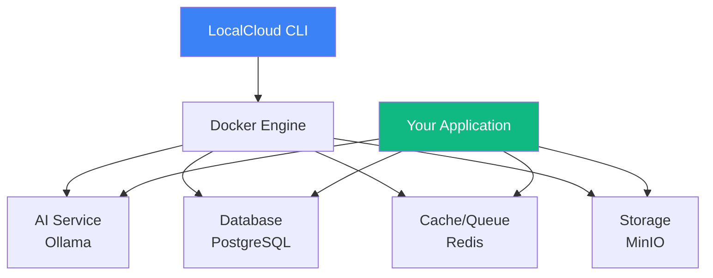

# Welcome to LocalCloud

LocalCloud is an open-source, local-first AI development platform that eliminates cloud costs during development. Run AI models, databases, storage, and compute services entirely on your machine with a single command.

<Note>
    LocalCloud lets you develop AI applications locally with the same services you'd use in the cloud, but at **zero cost**.
</Note>

## What is LocalCloud?

LocalCloud orchestrates popular open-source tools into a cohesive platform that mimics cloud services locally:

- **Ollama** for running LLMs (Llama, Mistral, Qwen, etc.)
- **PostgreSQL** for relational database with vector extensions
- **Redis** for caching and message queuing
- **MinIO** for S3-compatible object storage
- **Whisper** for speech-to-text processing

<CardGroup cols={2}>
    <Card
        title="Zero Cloud Costs"
        icon="dollar-sign"
        color="#10b981"
    >
        Develop AI applications without paying for cloud services during development
    </Card>
    <Card
        title="One Command Setup"
        icon="rocket"
        color="#3b82f6"
    >
        Get started with `lc init` - all services configured automatically
    </Card>
    <Card
        title="Production Compatible"
        icon="cloud"
        color="#8b5cf6"
    >
        Same APIs as cloud services - seamless transition to production
    </Card>
    <Card
        title="Language Agnostic"
        icon="code"
        color="#f59e0b"
    >
        Works with Python, Node.js, Go, Java, or any language
    </Card>
</CardGroup>

## Why LocalCloud?

### Traditional Cloud Development Costs

When developing AI applications in the cloud, costs quickly escalate:

- **GPU instances**: $100-1000+/month
- **Database instances**: $50-500/month
- **Storage and bandwidth**: Variable but significant
- **Development/testing**: Multiplies all costs

### LocalCloud Benefits

- **$0 cloud costs** during development
- **Full-featured environment** matching production
- **Faster iteration** without deployment cycles
- **Complete privacy** - your data stays local
- **Offline development** - work anywhere

## Key Features

<AccordionGroup>
    <Accordion title="Local AI Models" icon="robot">
        Run state-of-the-art language models locally:
        - Llama 2 & 3
        - Mistral & Mixtral
        - Qwen models
        - Code models (CodeLlama, DeepSeek)
        - Custom fine-tuned models

        All models are OpenAI API compatible for easy integration.
    </Accordion>

    <Accordion title="Integrated Services" icon="server">
        Everything you need for modern app development:
        - **PostgreSQL 16** with pgvector, pg_trgm extensions
        - **Redis 7** for caching and pub/sub
        - **MinIO** for S3-compatible storage
        - **Whisper** for audio transcription
    </Accordion>

    <Accordion title="Developer Experience" icon="code">
        Built for productivity:
        - Single command to start all services
        - Automatic port management
        - Service health monitoring
        - Integrated logging
        - Interactive setup wizard
    </Accordion>

    <Accordion title="Platform Agnostic" icon="globe">
        Works everywhere:
        - macOS (Apple Silicon & Intel)
        - Linux (Ubuntu, Debian, Fedora)
        - Windows (WSL2)
        - Docker Desktop or Docker Engine
    </Accordion>
</AccordionGroup>

## Architecture



## Use Cases

LocalCloud is perfect for:

<Tabs>
    <Tab title="AI Applications">
        - ChatGPT-like interfaces
        - RAG (Retrieval Augmented Generation) systems
        - AI agents and assistants
        - Code generation tools
        - Document analysis systems
    </Tab>
    <Tab title="Development">
        - Rapid prototyping
        - Learning AI development
        - Hackathons and demos
        - Testing before cloud deployment
        - Offline development
    </Tab>
    <Tab title="Cost-Sensitive">
        - Startups and indie developers
        - Educational projects
        - Open-source development
        - Personal projects
        - POCs and MVPs
    </Tab>
</Tabs>

## Quick Example

Here's how easy it is to get started:

```bash
# Install LocalCloud (macOS with Homebrew)
brew install localcloud-sh/tap/localcloud

# Or use the install script
curl -fsSL https://raw.githubusercontent.com/localcloud-sh/localcloud/main/scripts/install.sh | bash

# Initialize a new project
lc init my-ai-app

# Start all services
lc start

# Your services are now running!
# AI API: http://localhost:11434
# PostgreSQL: localhost:5432
# Redis: localhost:6379
# MinIO: http://localhost:9000
```

## Next Steps

<CardGroup cols={2}>
    <Card
        title="Installation"
        icon="download"
        href="/getting-started/installation"
    >
        Install LocalCloud on your system
    </Card>
    <Card
        title="Quick Start"
        icon="play"
        href="/getting-started/quickstart"
    >
        Create your first project in 5 minutes
    </Card>
    <Card
        title="CLI Reference"
        icon="terminal"
        href="/cli/overview"
    >
        Explore all available commands
    </Card>
    <Card
        title="Services"
        icon="server"
        href="/concepts/services"
    >
        Learn about available services
    </Card>
</CardGroup>

## Community

Join our growing community:

- **GitHub**: [github.com/localcloud-sh/localcloud](https://github.com/localcloud-sh/localcloud)
- **Discord**: [Join our Discord](https://discord.gg/localcloud)
- **Twitter**: [@localcloud_dev](https://twitter.com/localcloud_dev)

<Info>
    LocalCloud is open-source and welcomes contributions! Check our [GitHub repository](https://github.com/localcloud-sh/localcloud) to get involved.
</Info>